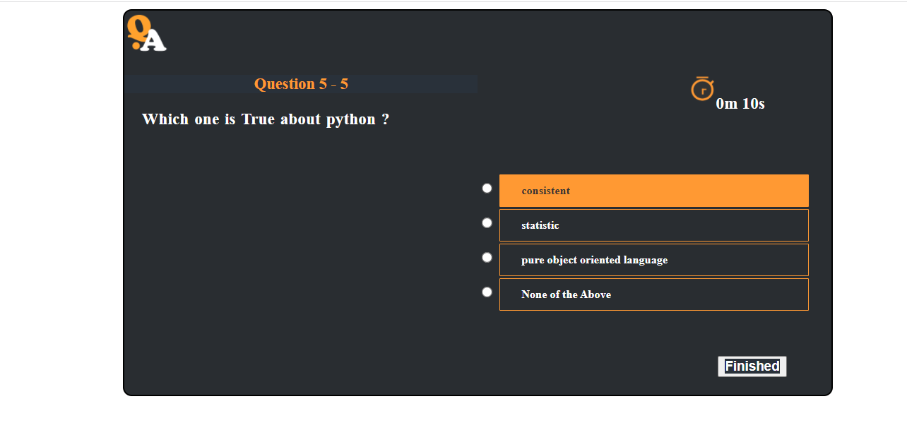

# QuestionAnswering Simple Django  Project
This is django project for Question and Answer application. 

## Setup
The first thing to do is to clone the repository:

```sh
$ git clone https://github.com/OliyadKebede/Portfolio-.git
$ cd demo_questionanswering_project
```

Once `setup` has finished :

```sh
$ python manage.py runserver
```
And navigate to `http://127.0.0.1:8000/`.

### Do this
Before you interact with the application , add your topic and multiple questions you want. <br>
if you need sample questions feel free to use `programming topic` , contain a few questions.

#### Screenshot



##### Contributing
I love contributions, so please feel free to fix bugs, improve things, provide documentation. Just send a pull request.

###### License
You're allowed to use the project for any intended action